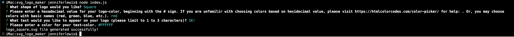

# SVG Logo Maker

This repository contains files relating to the 'SVG Logo Maker', which can dynamically create a logo and save it to a .svg file based on a user’s inputs and using only the command-line interface. 

• Testing using 'Jest' can be run by entering 'npm run test' in the CLI. All 3 shapes pass the tests that were written to check them.

• The app itself is invoked by entereing 'node index.js' in the CLI.

• Below is a screenshot of the 'SVG Logo Maker' passing testing.

• Below is a screenshot of the 'SVG Logo Maker' app and an example of a logo it can output.

• Here is a link to a video demonstration of the app in action: 

• Here is a link to one of the files generated in the demonstation video:
https://github.com/KPL33/svg_logo_maker/blob/main/examples/logo_circle.svg